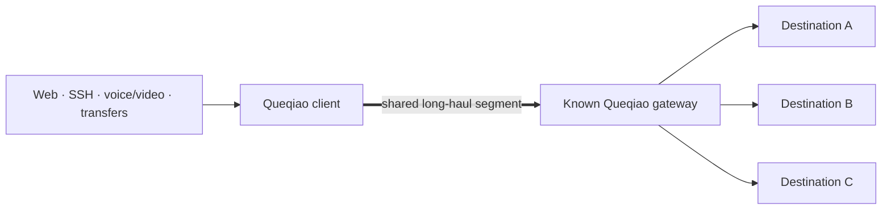
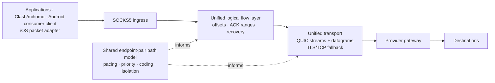

<p align="center">
  
</p>

<h1 align="center">Queqiao</h1>

<p align="center">
  <strong>WAN optimization for difficult long-haul links.</strong><br>
  One authenticated transport, one shared path model, and recovery that does not
  assume every lost packet means congestion.
</p>

<p align="center">
  <a href="docs/DEPLOYING.md">Deploy</a> ·
  <a href="docs/DESIGN.md">Design</a> ·
  <a href="docs/STATUS.md">Project status</a> ·
  <a href="docs/README.md">Documentation</a>
</p>

Queqiao is a self-hosted performance-enhancing proxy for traffic crossing a
known, difficult WAN segment. A local SOCKS5 agent carries TCP and UDP traffic
to a known gateway or relay over QUIC, with authenticated TLS/TCP fallback.
It is usable from source today and is being prepared as a public preview.

> [!IMPORTANT]
> Queqiao is an evolving protocol, not a claim that one transport is optimal on
> every network. Protocol version 1 is the only supported wire version. The
> implementation is functional; broader protocol-1 field qualification and
> independent security review remain open. See [current status](docs/STATUS.md).

## Why Queqiao?

Most congestion controllers must work for arbitrary connections to arbitrary
destinations. They therefore learn a separate model inside each connection and
normally treat packet loss as evidence that the connection should yield.

Queqiao starts from a structured deployment fact: many application flows converge
on the same client-to-gateway long-haul segment. Their eventual destinations
are different, but their dominant bottleneck is often shared.



That changes the design space:

- path knowledge can be shared across flows instead of relearned per
  destination;
- rate-independent erasure can be distinguished from overload at the actual
  bottleneck;
- latency-sensitive recovery can spend parity instead of waiting another long
  round trip;
- one aggregate policy can keep control and interactive traffic moving while
  bulk traffic fills the remaining pipe; and
- on an operator-controlled paired segment, TCP friendliness is not a design
  requirement. Queqiao can be aggressive against erasure while remaining
  disciplined at a real congestion knee.

The measured path that motivated Queqiao had two regimes: roughly 42–45%
rate-independent downstream erasure below its capacity knee, then clustered
loss once offered traffic exceeded the shared bottleneck. Those regimes demand
opposite responses. This is a measured example—not an assumption that every
China–US, hotel, home, or mobile link behaves the same way. See the
[path characterization](docs/PATH-CHARACTER-20260813.md).

The endpoint-pair pattern appears in many deployments:

| Scenario | Shared WAN segment Queqiao can optimize |
| --- | --- |
| Intercontinental tunnel or proxy | user/branch to a gateway or egress on another continent |
| Remote corporate access | employee or remote site to the corporate VPN gateway |
| Weak access network | hotel, residential, mobile, or rural uplink to a stable relay |
| Tailscale-like overlay | an individual long-haul link between two overlay endpoints |

The current repository provides the paired data plane and provider operations.
An overlay product can use that data plane per WAN leg; peer discovery, global
routing, and a full mesh control plane are separate concerns.

## Architecture at a glance

Queqiao does not expose separate “short-flow,” “interactive,” and “bulk”
transports. Every TCP flow uses the same logical framing, byte-offset sequence
space, acknowledgement ranges, recovery machinery, and authenticated transport
pool. UDP uses the same session and path infrastructure while preserving
datagram semantics.



A behavioral classifier observes bytes, direction, rate, age, and idle gaps.
Its `NEW`, `INTERACTIVE`, and `BULK` states are internal policy signals—not
application-selected modes or three architectural branches. They can adjust
queue priority, coding value, pacing reserve, reactive isolation, and TCP
fallback striping while the logical flow remains the same.

## Quick start

Queqiao currently builds from source with the Go version declared in
[`go.mod`](go.mod):

```sh
go test ./...
go build -o ./queqiaod ./cmd/queqiaod
```

On the provider gateway, initialize one provider, add a user, and issue a
single-use invitation:

```sh
sudo ./queqiaod provider init \
  --state /var/lib/queqiao/provider \
  --name "Example Network" \
  --endpoint gateway.example.net:443

sudo ./queqiaod provider add-user \
  --state /var/lib/queqiao/provider \
  --name alice \
  --max-sessions 8

sudo ./queqiaod provider invite \
  --state /var/lib/queqiao/provider \
  --user alice

sudo ./queqiaod server \
  --state /var/lib/queqiao/provider \
  --listen :443
```

Send the printed `queqiao://` URI to the user over a private channel. On the
client:

```sh
./queqiaod enroll 'queqiao://enroll/…'
./queqiaod client --profile ~/.config/queqiao/PROVIDER_ID.json
```

The client listens on `127.0.0.1:1080` by default. Applications can use it as
an ordinary SOCKS5 proxy, including UDP ASSOCIATE; Clash/mihomo can connect with
the [starter profile](deploy/clash-queqiao.yaml). The complete guide covers
service installation, multiple users, source-interface selection, verification,
upgrades, and rollback in [Deploying Queqiao](docs/DEPLOYING.md).

## Network design principles

The transport is shaped by six concrete properties of the target WAN segment:

1. **The endpoint pair is the congestion domain.** Flows to different final
   destinations cross the same client–gateway bottleneck, so loss, delivery
   rate, pacing, and latency reserve are coordinated across the aggregate—not
   estimated independently as if every flow used a different path.
2. **The loss process matters more than a loss event.** A stable independent
   erasure floor below the capacity knee is not relieved by backing off;
   clustered loss that appears as offered rate crosses the knee is congestion.
   The controller responds to the regime rather than mapping every loss to the
   same action.
3. **Offered load is controlled at the shared bottleneck.** With an erasure
   probability `p`, delivered rate and wire rate differ materially. Queqiao
   paces the aggregate against the endpoint-pair budget and reserves room for
   control and interactive traffic instead of letting each flow independently
   fill the pipe.
4. **Recovery is chosen against WAN round-trip cost.** On a long-fat path,
   waiting for retransmission can add hundreds of milliseconds, while coding
   every byte wastes scarce wire capacity. Sliding-window FEC is useful while
   avoiding another RTT dominates; retransmission becomes preferable as a flow
   grows. The transition happens inside the same logical flow.
5. **Feedback cannot wait behind the data it releases.** ACKs and recovery
   control use a reliable path that is not queued behind coded data. Under
   contention, priority and reactive isolation keep a bulk stream from
   head-of-line blocking the feedback or new work needed by other flows.
6. **The two directions are separate channels.** Loss, RTT contribution, and
   capacity can be strongly asymmetric. Queqiao maintains direction-specific
   recovery and rate state instead of copying a downstream loss model onto the
   upstream.

The details and the measurements that rejected earlier multipath designs are in
the [current design](docs/DESIGN.md) and [architecture](docs/ARCHITECTURE.md).

## How this differs from conventional designs

BBR is a congestion controller, not a proxy protocol. A proxy carried over
WebSocket/TLS/TCP with BBR is a perfectly valid stack. TUIC-like systems make a
different choice by carrying proxy traffic over QUIC. Queqiao should therefore
be compared by layer, not by pretending these names are interchangeable.

| Question | TCP proxy with BBR | Typical QUIC proxy | Queqiao |
| --- | --- | --- | --- |
| Congestion state | Normally per TCP connection | Normally per QUIC connection | Shared endpoint-pair model plus connection state |
| Loss recovery | Ordered retransmission | Stream retransmission; datagrams are unreliable | Retransmission plus selective sliding-window coding |
| High random loss | BBR can avoid treating every loss as Reno-style congestion, but TCP still pays ordered recovery | Depends on QUIC controller and stream/datagram use | Explicitly models an erasure floor separately from the congestion knee |
| Scheduling scope | Determined by the proxy and its TCP connections | Determined by the proxy and QUIC connections | Aggregate policy across flows sharing the paired WAN segment |
| Fairness objective | TCP semantics and controller policy apply | Usually conventional per-connection fairness | No TCP-friendliness constraint on the controlled segment; aggregate overload is still paced |
| Protocol scope | Congestion control is supplied by the OS | Proxy transport over QUIC | Proxy, path model, recovery, scheduling, fallback, and identity are co-designed |

These are architectural distinctions, not a universal performance claim.
Queqiao publishes baselines—including results where it only reached parity—and
expects the answer to vary by path.

## One design, evaluated three ways

Queqiao does not ask an application to select a workload-specific transport.
We evaluate the same design against three workload families because improving
one must not silently damage the others.

| Workload family | Examples | What must be measured |
| --- | --- | --- |
| Short-lived | `curl`, API calls, page resources | cold/warm setup, first byte, completion time, recovery tail |
| Interactive | SSH, voice, video, small requests during contention | latency, jitter, packet delivery, and tail behavior while bulk traffic runs |
| Bulk | large downloads and uploads | useful goodput, completion rate, parity/retransmission overhead, CPU, memory, and bounded recovery |

The deterministic harness supports path characterization, matched proxy
baselines, contention tests, and archival reports. Start with
[Measuring this transport](docs/BENCHMARKING.md); real-network submissions use
the [field-validation matrix](docs/FIELD-VALIDATION.md).

## What works today

- SOCKS5 TCP CONNECT and UDP ASSOCIATE on desktop/server builds
- pooled QUIC streams and QUIC datagrams with automatic TLS/TCP fallback
- one-time invitation enrollment, per-device certificates, renewal, revocation,
  and per-user session limits
- unified byte-offset framing, bounded replay, lane replacement, and UDP relay
  reclamation
- shared path measurement, erasure-aware control, sliding-window coding,
  priority scheduling, and reactive bulk isolation
- native Android and iOS source clients using the same protocol-1 core: the
  Android app exports an authenticated local SOCKS5 endpoint for whichever
  routing client already owns the device tunnel, and the iOS app is a packet
  tunnel with a bounded bypass subset
- bounded JSON logs, Prometheus-style metrics, a local visualizer, deterministic
  benchmarks, release packaging, SBOMs, and cross-platform automation

The current deployment shape, evidence, and remaining qualification gaps are
kept in [Project status](docs/STATUS.md). Known product and operational limits
are listed separately in [Known limitations](docs/KNOWN-LIMITATIONS.md).

## Security and privacy

Normal traffic always uses TLS 1.3 with a provider-pinned gateway identity and
provider-issued per-device mutual authentication. There is no plaintext mode,
shared tunnel password, or DNS/WebPKI identity requirement. The provider can
observe destinations and traffic shape; Queqiao is not an anonymity network.

Read the [security model](SECURITY.md), [privacy statement](PRIVACY.md), and
[protocol specification](docs/PROTOCOL.md). Report vulnerabilities privately as
described in [SECURITY.md](SECURITY.md).

## An evolving WAN optimization protocol

The maintainers do not have access to every residential ISP, carrier, hotel,
campus, enterprise firewall, or cross-continent route. Community evidence is
therefore part of the design process, not just post-release support.

Useful contributions include reproducible path characterizations, counterexamples
to the current assumptions, workload regressions, middlebox behavior, and
comparisons run in the same time window. Please remove credentials, private
addresses, and user traffic before sharing. See
[Contributing network evidence](docs/CONTRIBUTING-NETWORK-EVIDENCE.md) and the
general [contribution guide](CONTRIBUTING.md).

Wire changes increment the protocol version and fail closed. Mechanisms can
evolve; compatibility and evidence must remain explicit. The durable vision is
documented in [Vision and design principles](docs/VISION.md).

## Documentation

The [documentation index](docs/README.md) separates current guides, design
reference, qualification material, and historical development records. Start
there if you are evaluating the project rather than installing it immediately.

Queqiao is available under the [MIT License](LICENSE).
