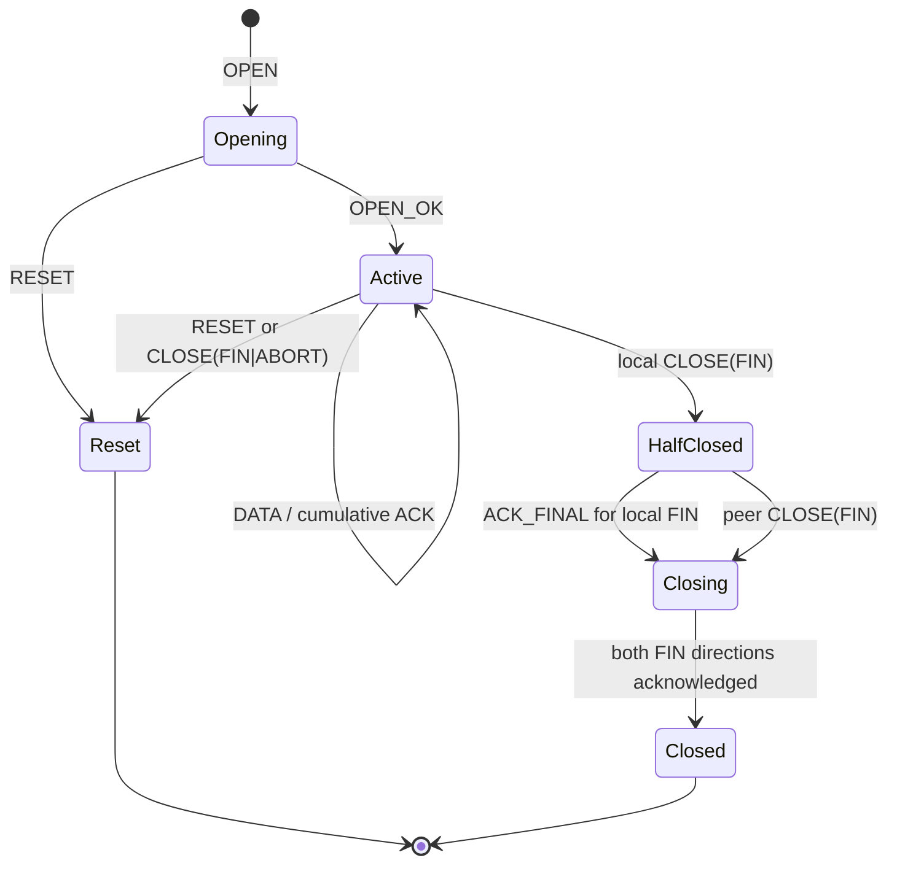

# Niulang protocol version 1

> [!IMPORTANT]
> **Status:** First public wire contract
>
> **Wire version byte:** `1`
>
> **Data ALPN:** `queqiao/1`
>
> **Compatibility:** Version 1 only; mismatches fail closed
> **Last reviewed:** 2026-08-19

This document specifies the protocol implemented by the current Niulang source
tree. Earlier private development builds used higher internal wire numbers.
Those builds were never a public compatibility contract; the first public
protocol is deliberately numbered 1 and has no legacy handshake or downgrade
path.

The key words **MUST**, **MUST NOT**, **SHOULD**, and **MAY** describe protocol
requirements. Unless stated otherwise, integers are unsigned and encoded in
network byte order (big-endian).

## 1. Protocol layers

Niulang version 1 has four related layers:

1. **Identity bootstrap:** a `niulang://` invitation and a bounded enrollment
   exchange create a per-device identity.
2. **Authenticated carrier:** TLS 1.3 over QUIC/UDP or TCP establishes the
   provider, gateway, account, and device principal.
3. **Logical flow protocol:** fixed-size frame headers carry TCP byte streams,
   UDP packets, acknowledgements, recovery state, and lane lifecycle.
4. **Optional coded datagram substrate:** QUIC DATAGRAM carries selected DATA
   frames through a sliding-window erasure code. The reliable QUIC stream
   always remains the control substrate.

Application TLS is not terminated. Niulang sees the requested destination,
frame sizes, and timing, then relays application bytes or datagrams.

## 2. Carrier and TLS contract

The gateway normally listens on the same numeric port for UDP and TCP.

| Purpose | Carrier | TLS authentication | ALPN |
| --- | --- | --- | --- |
| Data over QUIC | QUIC over UDP | mutual TLS | `queqiao/1` |
| Data over TCP | TLS over TCP | mutual TLS | `queqiao/1` |
| TCP hot standby | TLS over TCP | mutual TLS | `niulang-standby/1` |
| First enrollment | TLS over TCP | pinned gateway; no client certificate | `queqiao-enroll/1` |
| Device renewal | TLS over TCP | mutual TLS | `queqiao-renew/1` |

TLS 1.3 is mandatory. There is no plaintext data mode and no application-level
shared tunnel secret.

### 2.1 Provider and endpoint identity

The invitation pins a self-signed Ed25519 provider root by SHA-256 fingerprint.
The client validates a complete certificate chain to that exact root and checks
one gateway URI identity:

```text
queqiao://PROVIDER_ID/gateway/GATEWAY_ID
```

DNS names are routing inputs, not identities. A device certificate contains a
client-auth identity of the form:

```text
queqiao://PROVIDER_ID/account/ACCOUNT_ID/device/DEVICE_ID
```

Constrained gateway and device issuers separate certificate roles. A gateway
certificate cannot authenticate as a device, and a device certificate cannot
authenticate as a gateway.

The server MUST authorize the device public key and mutable account/device
state during the TLS handshake. A long-lived QUIC connection MAY carry many
streams, so the server re-authorizes the established principal before accepting
each new OPEN, JOIN, or PROBE stream. Active resources are also subject to
server-side revocation checks.

### 2.2 ALPN isolation

The unauthenticated enrollment TLS configuration is selected only when the
client offers exactly `queqiao-enroll/1`. Renewal is selected only when the
client offers exactly `queqiao-renew/1`. Offering either control ALPN alongside
another protocol MUST NOT select the weaker enrollment configuration.

A normal data connection that does not negotiate `queqiao/1` is incompatible
and MUST be rejected. `niulang-standby/1` is accepted only on TLS/TCP and enters
the auxiliary state machine below; it cannot open a destination. Neither
endpoint falls back to a previous Niulang protocol.

### 2.3 QUIC and TCP carriage

Each QUIC bidirectional stream or TLS/TCP connection carries a sequence of
Niulang frames on its reliable byte stream. QUIC connections negotiate DATAGRAM
support; when both endpoints support it, the same connection can additionally
carry coded DATA frames and UDP PACKET frames as datagrams.

One QUIC connection may pool many logical flows on separate streams. QUIC
datagrams are connection-scoped and are demultiplexed by the `flow_id` inside
the recovered Niulang frame.

The automatic carrier policy keeps a concurrent mixed-resource fanout on that
pooled connection so short resources share one measured congestion state rather
than starting several independent probes against the same bottleneck. Sustained
bulk may occupy at most one proactive secondary QUIC connection at a time. A
pending proactive dial is one scheduling decision, not permission for another
dedicated fallback. Healthy-flow isolation and failed-lane recovery have
different ceilings: recovery may exceed the one-secondary healthy-path limit,
but remains bounded by the existing lane, connection, and memory limits.

All QUIC controllers for one provider path contribute to one path model. The
model retains total measured erasure separately from its lower envelope. Total
erasure sizes adaptive FEC; only the lower envelope may compensate the pacing
rate and congestion window. Loss above that envelope remains congestion
evidence and MUST NOT enlarge the wire rate. In particular, startup queue loss
from a secondary connection cannot overwrite a previously measured clean lower
envelope. This separation preserves FEC while preventing sender overshoot from
feeding back as apparent ambient erasure.

TCP uses the identical reliable frame stream. A flow that has handed off to
TCP MUST NOT simultaneously schedule data over QUIC. A configured TCP-only
bundle may attach additional authenticated TCP lanes with JOIN; each socket
retains its kernel congestion controller, while Niulang preserves one logical
byte-offset space above them.

### 2.4 Registered TCP standby

Automatic clients maintain at most one hot TLS/TCP standby per provider path.
It negotiates `niulang-standby/1`, which is a separately versioned auxiliary
protocol that reuses the version-1 frame envelope without changing the
`queqiao/1` data contract. A gateway that does not implement it rejects the
ALPN; ordinary protocol-1 data remains interoperable.

The first frame is PROBE with a random non-zero `session_id` used only as the
standby generation, `flow_id` zero, sequence one, class NEW, and one-byte value
1 selecting atomic handoff. Subsequent heartbeats repeat that generation with strictly
increasing sequence numbers. The gateway echoes each accepted PROBE exactly;
the latest echo is positive application-level evidence that authenticated TCP
to the same endpoint is healthy. Other values are rejected. Matched experiments
found that retaining a degraded QUIC data lane after TCP activation amplified
cross-carrier reordering and head-of-line stalls, so it is not a protocol mode.

The gateway re-authorizes every heartbeat, admits at most one standby per
provider/account/device principal, bounds aggregate standby capacity
separately from active flows, and expires standbys. A duplicate registration
for a principal with a live standby is refused, preventing two processes that
share a device profile from replacing each other continuously. Registration
consumes no destination, logical-flow, or account-flow slot.

Activation replaces a heartbeat with either an ordinary JOIN naming an
existing byte-stream flow or a resumable UDP-association OPEN. The latter can
only reclaim or create a destination-free UDP relay; an arbitrary destination
OPEN on the standby ALPN is rejected. The gateway validates principal,
identifiers, authorization, account limits, and active-session capacity before
acknowledging either form. For JOIN, both endpoints retire QUIC only after
OPEN_OK for the staged TCP lane has been written; a malformed/refused
activation or failed acknowledgement MUST leave existing QUIC lanes unchanged.
The claimed standby then becomes the normal protocol-1 TCP data connection or
UDP-on-stream association.

## 3. Identifiers and scope

| Identifier | Width | Requirement | Scope |
| --- | ---: | --- | --- |
| `session_id` | 128 bits | Random and non-zero, except no all-zero value is accepted | Names the logical session and its replacement lanes |
| `flow_id` | 64 bits | Random and non-zero for TCP/UDP flows; zero only for PROBE | Demultiplexes a flow within a session/connection |
| `lane_id` | 64 bits | Non-zero on JOIN; lane zero is the initial lane | Names a physical carrier attached to a logical flow |
| UDP resume token | 128 bits | Random, single-use, principal-bound | Reclaims one retained gateway UDP relay |

Identifiers route authenticated state; none is a credential. A JOIN or UDP
resume request MUST have the same provider/account/device principal as the
resource creator. Implementations MUST NOT authorize a request from possession
of an identifier alone.

## 4. Frame envelope

Every logical frame begins with this fixed 46-byte header:

| Offset | Size | Field | Version-1 rule |
| ---: | ---: | --- | --- |
| 0 | 2 | magic | ASCII `WO` (`0x57 0x4f`) |
| 2 | 1 | version | `0x01` |
| 3 | 1 | type | One value from §5 |
| 4 | 2 | flags | Only flags valid for the frame type |
| 6 | 16 | session ID | Opaque bytes |
| 22 | 8 | flow ID | Unsigned integer |
| 30 | 8 | sequence | Meaning depends on frame type |
| 38 | 4 | payload length | Number of bytes following this header |
| 42 | 1 | traffic class | `0`, `1`, or `2` |
| 43 | 3 | reserved | All zero |

The frame header and payload form one record. A datagram MUST contain exactly
one complete encoded frame after coded-substrate reassembly; trailing bytes are
invalid.

### 4.1 Payload limit

The payload limit is **131072 bytes (128 KiB)**. It is a constant of the wire,
not a deployment setting. A receiver MUST accept a frame whose payload length
is 131072, MUST reject one whose payload length is 131073 or more, and MUST
apply the same limit in both directions. An implementation MUST NOT expose the
limit as configuration.

This is a consequence of version 1 having no capability negotiation. Two peers
holding different limits are mutually intelligible in one direction only, and
the symptom -- a frame the sender considers legal being refused as malformed --
names neither the setting nor the peer that holds it. A limit that is not
negotiated must therefore be fixed.

The value is derived rather than round. The largest frame version 1 can require
a peer to accept is a PACKET (§13) carrying a maximum-size UDP datagram to a
maximum-length destination:

| Component | Bytes |
| --- | ---: |
| destination length prefix | 2 |
| destination (§8.1 bound) | 255 |
| UDP datagram (65535 - 20 IP - 8 UDP) | 65507 |
| **largest required payload** | **65764** |

Every other frame is smaller by construction: an OPEN destination payload is at
most 255 bytes, an ACK payload at most 256 (§9.2), a PROBE payload at most 1200
(§14). DATA is chunked by the sender to any size at or below the limit; the
chunk size is a sending policy and is the only part of this that a deployment
may set. A receiver MUST NOT assume any particular chunk size.

An implementation whose receive limit is below 65764 cannot deliver a
maximum-size UDP reply. That is a functional failure, not a smaller buffer, and
it is invisible until a specific datagram arrives.

### 4.2 Rejection

The receiver MUST reject bad magic, a version other than 1, an unknown type,
unknown flags, a class above 2, non-zero reserved bytes, or a payload length
above 131072. A version mismatch is reported distinctly from malformed framing
so an operator can perform a coordinated upgrade.

A receiver that rejects a frame for exceeding the payload limit MUST treat the
connection as carrying a peer that disagrees about the wire, and MUST NOT
attempt to resynchronize within it: the declared length is what delimits the
next frame, so a receiver that skipped the frame would have to trust the number
it just refused.

## 5. Frame types

| Value | Name | Purpose | Normal payload |
| ---: | --- | --- | --- |
| 1 | `OPEN` | Create a TCP flow or UDP association | Destination or UDP marker |
| 2 | `OPEN_OK` | Accept OPEN or JOIN | Empty, except resumable UDP grant |
| 3 | `JOIN` | Attach a replacement/isolation/TCP lane | 8-byte lane ID |
| 4 | `DATA` | Carry bytes at a logical offset | Application bytes |
| 5 | `ACK` | Acknowledge a cumulative byte offset and optional ranges | Optional ACK ranges |
| 6 | `CLOSE` | Declare a direction's final offset or abort | Empty |
| 7 | `RESET` | Refuse or terminate with a coarse reason | Reset code and text |
| 8 | `PACKET` | Carry one UDP datagram and destination | Encoded UDP packet |
| 9 | `PROBE` | Bounded authenticated path padding/echo | Non-empty padding |

The first frame on an authenticated stream MUST be OPEN, JOIN, or PROBE. All
later frames must match the session and flow established by that first frame.

## 6. Flags

| Bit | Name | Valid use |
| ---: | --- | --- |
| 0 | `FIN` | Required on CLOSE |
| 1 | `ACK_FINAL` | ACK that confirms a final offset |
| 2 | `ACK_UP` | ACK covers client-to-gateway bytes |
| 3 | `ACK_DOWN` | ACK covers gateway-to-client bytes |
| 4 | `CLOSE_ABORT` | CLOSE cancels both directions instead of half-closing one |
| 5 | `RESERVE_CONTROL` | OPEN reserves the initial lane as control, or JOIN replaces that role |
| 7 | `ACK_RANGES` | ACK payload contains selective byte ranges |

Bits 6 and 8–15 are reserved and MUST be zero. `RESERVE_CONTROL` is invalid on
any type other than OPEN or JOIN. `ACK_RANGES` is invalid on any type other
than ACK.

State-machine validation is stricter than header parsing:

- DATA, OPEN_OK, RESET, PACKET, and PROBE normally carry zero flags.
- A TCP-flow ACK carries exactly one of `ACK_UP` or `ACK_DOWN`; it may add
  `ACK_FINAL` or `ACK_RANGES`, but a final ACK has no range payload.
- A UDP close ACK is `ACK_FINAL` with no direction bit and sequence zero.
- CLOSE carries `FIN` and may add `CLOSE_ABORT`; ACK direction/final bits are
  invalid on CLOSE.

## 7. Traffic class is a hint

The class byte has these values:

| Value | Name |
| ---: | --- |
| 0 | `NEW` |
| 1 | `INTERACTIVE` |
| 2 | `BULK` |

Class is behavioral metadata used by scheduling and telemetry. It is not a
separate flow protocol, an authorization boundary, or an application-declared
quality-of-service entitlement. A receiver MUST NOT trust the class byte to
grant access or allocate unbounded resources. The class may change over the
life of one flow while all other identifiers and sequencing remain unchanged.

## 8. Opening a flow

### 8.1 TCP destination OPEN

The client chooses a non-zero random session ID and flow ID. OPEN uses sequence
zero, class NEW, and either zero flags or `RESERVE_CONTROL`. Its payload is the
UTF-8/ASCII-compatible canonical `host:port` destination:

- payload length is 1–255 bytes;
- host is non-empty and contains no space or control character;
- port is decimal in the range 1–65535;
- IPv6 literals use brackets; and
- alternate spellings such as zero-padded ports are canonicalized.

DNS resolution and destination policy are applied at the gateway. Private,
loopback, multicast, link-local, and unspecified destinations are rejected by
default at the product-policy layer.

The gateway answers with matching session/flow IDs:

- OPEN_OK with an empty payload after the destination is accepted; or
- RESET with a coarse error payload.

The client may optimistically accept application bytes and send DATA before it
receives OPEN_OK. On the reliable stream, OPEN precedes those DATA frames. If
the first DATA also uses coded datagrams, the sender places one bounded safety
copy of its first frame behind OPEN on the reliable stream until OPEN_OK is
observed. The receiver may briefly hold a bounded number of coded frames that
arrive before their OPEN is processed.

### 8.2 UDP association OPEN

An OPEN payload beginning with the following exact five-byte marker creates a
basic UDP association:

```text
57 4f 55 44 01    # "WOUD" + 1
```

A resumable association uses:

```text
57 4f 55 44 02 [optional 16-byte resume token]
```

With no token, the gateway creates a relay and returns an OPEN_OK payload:

| Offset | Size | Field |
| ---: | ---: | --- |
| 0 | 1 | `resumed`: `0` for fresh, `1` for reclaimed |
| 1 | 16 | newly issued single-use resume token |

With a token, the gateway attempts to reclaim the retained relay belonging to
the same authenticated device. An unknown, expired, used, or wrong-principal
token degrades to a fresh relay; it never authorizes access to another relay.
Every successful open issues a new token, including a successful resume.

## 9. TCP byte-stream state machine

Both application directions have independent sequence and FIN state within the
same logical flow.



The diagram is conceptual: optimistic DATA may be in flight during Opening,
and either direction can half-close first.

### 9.1 DATA

For DATA, `sequence` is the zero-based byte offset of `payload` in the sender's
application byte stream. The interval carried is
`[sequence, sequence + payload_length)`. Receivers place segments by offset,
deduplicate overlap, buffer within explicit limits, and deliver only the
contiguous prefix to the application.

Arrival order is not application order. DATA may be retransmitted on a
replacement lane, delivered out of order by coded datagrams, or striped across
configured TCP fallback lanes without changing its logical offset.

### 9.2 ACK

For ACK, `sequence` is the cumulative next byte: every byte below it in the
direction named by `ACK_UP` or `ACK_DOWN` has arrived.

When `ACK_RANGES` is set, the payload is zero to 16 entries of:

| Offset within entry | Size | Field |
| ---: | ---: | --- |
| 0 | 8 | inclusive start |
| 8 | 8 | exclusive end |

Each `[start,end)` range MUST be non-empty, at or above the cumulative
sequence, sorted by start, and non-overlapping. Adjacent ranges are allowed.
The payload length MUST be a multiple of 16 and no greater than 256 bytes.

Protocol ACKs bound Niulang's retained replay window and report delivery across
unreliable or replacement substrates. They do not replace QUIC or TCP transport
acknowledgements and are not a second per-packet congestion-control loop.

### 9.3 CLOSE and final ACK

CLOSE carries an empty payload, `FIN`, and the sender's final byte offset in
`sequence`. A normal CLOSE half-closes that application direction. The receiver
waits for every preceding byte, half-closes its destination socket in the same
direction, and returns ACK with the corresponding direction bit plus
`ACK_FINAL` at the exact final sequence.

`CLOSE_ABORT` means the application has fully abandoned the flow. The peer may
stop both directions and release the destination without waiting for missing
bytes, but it still returns the best-effort final ACK.

A local TCP EOF alone does not distinguish a half-close from full abandonment
and MUST NOT immediately produce `CLOSE_ABORT`. Once additional receive-side
evidence arms a bounded abandonment timer, a successful write to the local
receive half or a strictly advancing cumulative ACK for this endpoint's
outbound bytes restarts the inactivity interval. A delayed or duplicate ACK is
not progress and cannot retain the flow indefinitely. Expiry without progress,
or an explicit failure writing to the local application, may produce
`CLOSE_ABORT`. This rule permits a response already buffered by its producer to
take longer than one cleanup interval to cross a slow path without weakening
bounded cleanup for a genuinely abandoned flow.

Final CLOSE and ACK state is idempotent. A server may retain a bounded,
metadata-only tombstone after both directions complete. A correctly
authenticated late JOIN can then receive the final ACK/CLOSE state; no
destination socket or application payload is retained in the tombstone.

## 10. Joining and replacing lanes

JOIN is the first frame on a separately authenticated stream or TLS/TCP
connection. It uses the existing non-zero session/flow IDs, sequence zero, and
an exactly eight-byte non-zero lane ID payload.

The gateway accepts JOIN only if:

- the target live flow or completion tombstone exists;
- the authenticated provider/account/device principal exactly matches the
  creator;
- the lane transport is compatible with the flow's current handoff state; and
- per-flow, per-user, and global lane limits permit it.

OPEN_OK acknowledges the join before the new lane becomes schedulable. RESET
refuses it. This ordering prevents replayed DATA from overtaking the join
acknowledgement.

`RESERVE_CONTROL` on JOIN replaces a failed control-lane generation. An
ordinary JOIN adds or replaces a data lane for isolation, recovery, or
configured TCP-only striping. The public protocol does not promise throughput
aggregation across QUIC connections; a QUIC flow has one data connection at a
time, apart from bounded transition/recovery state.

When the first TCP replacement is accepted for a QUIC flow, both endpoints
retire QUIC data lanes and continue on TCP. They do not mix QUIC and TCP data
for the same flow.

## 11. Reliable and datagram substrates

Every lane has a reliable control stream. Frame routing is:

| Frame | QUIC with DATAGRAM | QUIC without DATAGRAM | TLS/TCP |
| --- | --- | --- | --- |
| OPEN, OPEN_OK, JOIN, ACK, CLOSE, RESET, PROBE | reliable stream | reliable stream | reliable stream |
| DATA | coded datagram only while path coding and flow policy are active; otherwise stream | stream | stream |
| PACKET | QUIC datagram | stream fallback | stream fallback |

Control never enters the coded substrate. A DATA frame not recovered by FEC is
still missing at the logical-flow layer and can be reissued from retained
byte-offset state. PACKET retains UDP semantics and is not retransmitted merely
because its QUIC datagram was lost.

## 12. Coded datagram format

The coded substrate is directional and scoped to one QUIC connection. It
carries complete encoded Niulang frames inside source symbols and GF(256)
repair symbols. Its delivery remains unreliable; FEC reduces erasure but does
not create a second reliable stream.

### 12.1 Datagram headers

Every coded datagram begins with a 32-bit transmission sequence used to infer
loss from gaps, followed by an 8-bit kind.

Source datagram (`kind = 0`):

| Offset | Size | Field |
| ---: | ---: | --- |
| 0 | 4 | transmission sequence |
| 4 | 1 | kind `0` |
| 5 | 4 | encoding symbol ID (`ESI`) |
| 9 | variable | source-symbol vector |

Repair datagram (`kind = 1`):

| Offset | Size | Field |
| ---: | ---: | --- |
| 0 | 4 | transmission sequence |
| 4 | 1 | kind `1` |
| 5 | 4 | repair ID (`RID`) |
| 9 | 4 | first source ESI covered |
| 13 | 2 | number of consecutive source symbols covered |
| 15 | variable | repair vector |

Transmission sequence, ESI, and RID advance independently modulo 2³². Unknown
kinds and truncated datagrams are discarded.

### 12.2 Source-symbol vector

Every source vector begins:

| Offset | Size | Field |
| ---: | ---: | --- |
| 0 | 2 | meaningful payload length |
| 2 | 2 | fragment index |
| 4 | 2 | fragment count |
| 6 | variable | payload, zero-extended by repair arithmetic as needed |

For `fragment_count = 1`, the payload packs one or more complete Niulang frames,
each prefixed by a 32-bit frame length. A frame larger than one symbol uses
consecutive ESIs with a common fragment count and indexes `0..count-1`; its
payload is the direct frame bytes without the per-frame 32-bit prefix. The
receiver emits the frame only when all of its fragments are present or
recovered. Incomplete groups are discarded once they fall beyond the bounded
assembly window.

### 12.3 Repair arithmetic

Repair vectors are random-linear combinations over GF(256) using primitive
polynomial `0x11d` (`x^8 + x^4 + x^3 + x^2 + 1`). Shorter source vectors are
zero-extended to the longest vector in the repair window.

For repair ID `rid` and zero-based symbol position `index` within the advertised
window, both endpoints generate the non-zero coefficient:

```text
x = rid * 2654435761 + index * 2246822519       (mod 2^32)
x = x XOR (x >> 15)
x = x * 2654435761                              (mod 2^32)
x = x XOR (x >> 13)
x = x * 2246822519                              (mod 2^32)
x = x XOR (x >> 16)
coefficient = (x mod 255) + 1
```

The repair vector is the byte-wise XOR sum of each source vector multiplied by
its coefficient in GF(256). Coefficients are regenerated rather than sent. The
receiver may deliver recovered symbols out of order.

Because the coefficient row is never transmitted, an implementation that
computes it differently is not detectably wrong on the wire. Its repairs arrive
intact and simply fail to solve, which is indistinguishable from a lossy path.
An implementation MUST therefore be checked against the committed coefficient
rows in §20 before it is used against a peer it did not build.

### 12.4 Repair window bounds

Parity rate is sender policy derived from path state and is not negotiated.
Window size is **not** sender policy alone: it is what the sender may ask the
receiver to solve, so version 1 fixes both sides of it.

| Bound | Value | Applies to |
| --- | ---: | --- |
| maximum symbols one repair may cover | 256 | sender and receiver |
| minimum decoder assembly width, in symbols | 512 | receiver |

**Sender: repair span.** A repair MUST cover at least 1 and at most 256 consecutive source
symbols. 256 is the size of GF(256): a repair over more symbols could not draw
its coefficients from distinct field elements, so it is not merely
inconvenient but unrepresentable. A sender MUST NOT emit a repair whose count
field is 0 or greater than 256, whatever its own window policy is.

**Receiver: repair span.** A receiver MUST reject a repair whose count field is 0 or greater
than 256, before the symbol reaches its linear system. The count is two bytes
on the wire and can therefore claim a span of 65535; the rejection has to
happen at the point that still knows the datagram came from a peer. A rejected
repair MUST NOT be counted as an erasure: it is a peer disagreeing about the
wire, and treating it as loss would answer a non-conforming sender by buying
more parity for a channel that is not erasing anything.

**Receiver: assembly width.** A receiver MUST retain at least 512 source-symbol slots. A repair
may cover 256 symbols and arrive after further symbols have been sent, so a
window merely as wide as the widest repair would already have slid past that
repair's oldest symbol by the time it arrives. A receiver that discards a
symbol it was obliged to hold produces exactly the failure the code exists to
prevent: the repair is unsolvable, and the symbol is reported lost.

The floor is a floor. A receiver MAY hold more. It MUST NOT size the window
reactively in response to what arrives -- growing on demand cannot recover
values already reclaimed, so a legal full-span repair arriving at a
narrow-but-growing window still fails to solve.

Every repair carries the exact source window needed to decode it. Nothing else
about the window is on the wire, so the two numbers above are the whole of what
a sender may assume about a receiver.

## 13. UDP PACKET format and replay window

PACKET preserves exactly one UDP datagram boundary. Its payload is:

| Offset | Size | Field |
| ---: | ---: | --- |
| 0 | 2 | destination length `N` |
| 2 | `N` | canonical `host:port` destination |
| `2+N` | remaining | UDP payload, at most 65,507 bytes |

The destination follows the same canonical rules as TCP OPEN and is at most
255 bytes. Client-to-gateway packets may name a DNS host or IP; gateway replies
encode the numeric source address observed on the relay socket.

A maximum-size PACKET payload is therefore `2 + 255 + 65507 = 65764` bytes, and
this is the largest payload version 1 can require any peer to accept. It is
what fixes the frame payload limit in §4.1, and it is why that limit is not
configurable: a receiver configured below 65764 bytes silently loses
maximum-size UDP replies while every other flow appears healthy.

PACKET sequence is an independent monotonically increasing packet number in
each direction. Receivers use a 64-packet bitmap window: a new high sequence
advances the window, an unseen sequence within the window is accepted once,
and duplicates or older packets are dropped. A gap is normal UDP loss and does
not reset the association.

A graceful UDP dissociation sends CLOSE with `FIN`, sequence zero, and an empty
payload. The peer answers ACK with `ACK_FINAL`, sequence zero, and no payload.

## 14. Path PROBE

PROBE is authenticated, names no destination, and uses:

- a non-zero session ID;
- flow ID zero;
- sequence values starting at zero and increasing by one;
- class NEW and zero flags; and
- a non-empty payload of at most 1,200 bytes.

### 14.1 The echo

A probe exchange runs on one reliable stream and is bounded by:

| Bound | Value |
| --- | ---: |
| maximum payload bytes per PROBE frame | 1200 |
| maximum frames per probe stream | 128 |
| maximum total payload bytes per probe stream | 131072 |

The gateway MUST echo every frame it accepts, exactly once, with the same
header and the same payload, and MUST stop accepting frames once either total
is reached. The client half-closes its stream to delimit the request, reads the
echoes, and uses QUIC transport acknowledgements in each sending direction to
update that direction's endpoint-pair path state.

The echo is equal-size and mutually authenticated, so it cannot amplify traffic
or create an SSRF destination. That property is why the echo is mandatory
rather than advisory: the bounds above are the only thing standing between a
probe and an amplifier, and a peer free to answer with anything is not bound by
them.

An automatic client with active UDP associations MAY run a periodic one-frame
exchange on a separate stream of the same QUIC connection. Associations pooled
on one connection share that exchange. This is path-level liveness evidence,
not an acknowledgement for an application datagram: QUIC DATAGRAM packets are
not acknowledged or retransmitted and their disappearance is consequently
absent from ordinary transport loss counters. The client runs this low-rate
probe only while a recent registered-standby echo proves that clean TCP to the
same gateway is available. It treats only silence lasting the normal sustained
degradation window as failover evidence; a timely echo (within the larger of
two RTTs and one decision interval) clears the pending observation, while a
slow reliable echo retains it as HOL evidence.

A gateway MAY reserve bounded handler capacity for these authenticated probes
so a full active-session budget is not misreported as carrier failure. That
capacity accepts only a conforming destination-free PROBE and MUST NOT increase
OPEN, JOIN, account-flow, or active-session capacity.

### 14.2 The client's obligation

The stream is reliable, so a probe frame cannot be lost in transit. A client
that sent `n` frames and read `m` echoes therefore faces exactly three cases:

1. `m = n`, every echo matching its frame in type, session ID, flow ID,
   sequence, flags, class, and payload length. The exchange conformed.
2. The read budget expired with `m < n`. This is a slow path, not a violation.
   The client MUST treat it as an unfinished measurement and MUST NOT draw any
   conclusion about the peer from it.
3. The stream ended, or an echo did not match, with `m < n`. The peer does not
   implement §14.1. Because the version byte and the ALPN both said it did,
   this is a disagreement about the wire and not a path condition.

In case 3 the client MUST NOT continue using the connection. It MUST close the
lane and MUST NOT reuse the underlying carrier for further flows; it SHOULD
record the event distinctly from a lane or transport failure, because the two
call for opposite responses -- a failed lane is retried, and a peer that does
not implement the protocol is not.

A client MUST NOT tolerate a missing or partial echo as a compatibility
allowance. Version 1 has no version below it and no capability negotiation, so
a peer that negotiated `queqiao/1` and then did not echo is not an older build;
it is a peer this client cannot make correct measurements against, and silently
degrading to no measurement hides that.

Invalid ordering, identifiers, flags, class, size, or totals terminate the
probe at the gateway.

## 15. RESET payloads

RESET payload byte zero is a coarse code; up to 256 following bytes may carry
diagnostic UTF-8 text. Codes are:

| Value | Name | Meaning |
| ---: | --- | --- |
| 1 | `PROTOCOL` | Invalid state, frame, join, or unknown session |
| 2 | `AUTHENTICATION` | Authenticated identity is not permitted |
| 3 | `DESTINATION` | Destination is invalid, denied, or unavailable |
| 4 | `FLOW_LIMIT` | Session/flow/lane admission limit |
| 5 | `TRANSPORT` | Required relay or carrier resource unavailable |

Messages are deliberately coarse and MUST NOT expose private authorization or
infrastructure detail. A RESET is terminal for the stream/attempt it addresses.

## 16. Enrollment and renewal messages

Invitation/profile schema versions and enrollment-service version 1 are
independent namespaces from the data-plane wire byte, even though all are `1`
for the first public release.

### 16.1 Invitation URI

The URI is:

```text
niulang://enroll/BASE64URL_WITHOUT_PADDING(JSON)
```

The decoded strict JSON object contains:

| Field | Meaning |
| --- | --- |
| `v` | invitation schema, exactly `1` |
| `name` | display name, 1–128 characters |
| `provider` | provider ID |
| `endpoint` | gateway `host:port` |
| `gateway` | gateway ID |
| `root` | raw-base64url SHA-256 provider-root fingerprint |
| `token` | raw-base64url 256-bit enrollment bearer token |
| `expires` | RFC 3339 expiration, no more than seven days after issue |

Unknown fields, malformed endpoints, bad identifier shapes, excessive size,
and trailing JSON are rejected. The invitation is a short-lived credential and
must be delivered privately.

### 16.2 Message framing

Enrollment and renewal each exchange one request and one response on their
dedicated TLS connection. Every message is a 32-bit non-zero length followed by
one strict JSON object. The maximum message length is 64 KiB. Unknown fields or
trailing JSON values are invalid.

Enrollment request fields are `version` (`1`), `token`, `device_name`, and the
raw-base64url Ed25519 `public_key`. The device private key is generated and
persisted locally before the token is transmitted; it is never sent.

The successful response returns the provider/gateway identity, pinned root and
certificate, account/device IDs, issued device certificate, and issue time.
The client MUST validate that the certificate contains the locally generated
public key and the invited provider/gateway identity before saving the profile.

An exact retry after a lost enrollment response is idempotent for the already
registered device name and public key. A different key or name is a replay
failure, including after the invitation's original expiry.

Renewal uses mutual TLS on `queqiao-renew/1`, a request containing version `1`,
and the same bounded response form. Renewal MUST preserve provider, account,
device, and public-key identity.

## 17. Fallback behavior

Fallback is local policy around the same data protocol. In automatic mode the
client prefers QUIC and maintains the registered TLS/TCP standby in §2.4. A
merely slower TCP handshake is not proof that UDP failed. An established flow
hands off only after severe QUIC erasure or lack of progress remains sustained
for a bounded observation window, the flow materially degrades from its own
healthy history, and a recent standby heartbeat proves TCP to the same endpoint
is healthy. For a DATAGRAM-only UDP association, sustained silence on the
shared reliable path probe in §14 supplies the evidence that transport loss
counters cannot. A short loss burst clears pending evidence instead of
switching. A successful differential handoff places new automatic flows in the
existing TCP cooldown rather than forcing each one to rediscover the same path
failure.

An existing TCP byte stream can survive carrier loss by authenticating a JOIN
on the replacement transport and replaying unacknowledged logical offsets. UDP
rescue instead creates a new association and uses its principal-bound token to
reclaim the gateway relay socket. Datagrams in flight during failure remain
lost.

## 18. Versioning and extension rules

Version 1 has no generic capability-negotiation frame and no “ignore unknown”
extension rule. Unknown frame types, flags, classes, reserved bits, and wire
versions fail closed.

A future change that alters parsing, authentication, frame semantics, coded
datagram decoding, or state-machine behavior MUST increment the data protocol
version and change the data ALPN accordingly. It must document whether and how
operators can run both versions during a coordinated migration. Pre-1.0
software versioning does not waive this wire rule.

Changes to sender-only tuning that preserve every version-1 wire invariant—such
as pacing gains, classification thresholds, FEC rate selection, queue limits,
or fallback timing—do not require a wire increment.

Regenerating the conformance vectors in §20 is a wire change by definition. If
this build no longer produces them, either the wire moved and this section
applies, or a regression was introduced; there is no third case.

## 19. Security and resource invariants

- TLS 1.3 is mandatory and every data carrier is mutually authenticated.
- Provider-root pinning plus URI identity replaces DNS/WebPKI authentication.
- Mutable authorization is checked independently of certificate validity.
- Session, flow, lane, and resume identifiers never grant authority.
- Frame payloads (§4.1), ACK ranges, repair windows (§12.4), and probe
  exchanges (§14.1) are bounded by this specification, not by configuration:
  a bound that is not negotiated and not fixed is a bound two peers can
  disagree about without either being able to say so.
- Reassembly, replay, queues, lanes, retained relays, idle time, and flow
  lifetime are bounded by the implementation.
- Enrollment/renewal are isolated by exact ALPN and bounded strict messages.
- Malformed or unknown protocol input never selects a legacy parser.

## 20. Conformance vectors

Prose is not sufficient to specify all of version 1. The repair coefficients of
§12.3 are computed on both endpoints and never transmitted, so an
implementation that gets one shift or one multiplier wrong is not detectably
wrong on the wire -- its repairs arrive well-formed and fail to solve, and the
resulting erasures look exactly like the lossy path the code exists to fix.
Destination canonicalization has the same shape: two implementations that
canonicalize differently disagree about the identity of a destination without
either observing a parse error.

[`testdata/protocol1/vectors.json`](../testdata/protocol1/vectors.json) is
therefore normative. It is a frozen artifact, not a generated one. It covers:

| Section | What it pins |
| --- | --- |
| `limits` | every fixed number in this document, including the §4.1 payload limit and the §12.4 window bounds |
| `frame_headers` | encoded 46-byte headers a receiver must accept, and headers it must refuse |
| `ack_ranges` | selective-acknowledgement payloads and the malformed forms that must be refused |
| `destinations` | canonicalization: which inputs are accepted, what they canonicalize to, which are refused |
| `udp` | association and resume markers, resume grants, PACKET payloads, and refused PACKET forms |
| `reset_payloads` | the §15 code byte and message encoding |
| `fec_coefficients` | the §12.3 coefficient rows for a spread of repair IDs and window widths |
| `fec_repairs` | complete encode steps: source symbols in, one repair vector out |
| `coded_datagrams` | §12.1 datagram layouts, the frames each delivers, and the forms a receiver must refuse |
| `invitation` | a complete §16.1 enrollment URI and the fields it decodes to |

Every credential-shaped value in the file is synthetic. The invitation carries
fixed timestamps and a `parsed_at` instant to validate it against, because an
invitation is valid for at most seven days and a vector built against the wall
clock would be either unbuildable or unverifiable.

An implementation MUST reproduce the accepted vectors byte for byte and MUST
refuse every vector marked `reject`. Two implementations that agree on this
document but not on this file do not interoperate.

The broader threat model, credential lifecycle, and residual risks are in
[`SECURITY.md`](../SECURITY.md).
